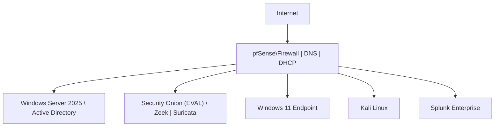

# JCE Cyber Lab 🛡️

## Executive Summary

The JCE Cyber Lab demonstrates my ability to **design, deploy, operate, and validate**
a complete **SOC detection engineering workflow** across **network, endpoint, and
identity layers**.

The lab consists of **hands-on attack simulations** with:
- Reproducible execution steps
- Real and symbolic log evidence
- Detection logic and alert definitions
- MITRE ATT&CK–aligned validation
- Documented issues, resolutions, and analyst takeaways

Each detection scenario has a **dedicated simulation folder (1:1 mapping)** to ensure
results are **repeatable, auditable, and defensible**.

---

## 🛡️ GRC Overlay (Audit-Ready Control Validation)

In addition to SOC detections, this repository includes a lightweight **GRC (Governance, Risk, and Compliance)** layer to ensure detections are not only functional, but also **documented, measurable, and auditable**.

Each simulation (SIM-001 → SIM-XXX) may also be treated as a **security control validation** with:
- Evidence IDs (audit traceability)
- Control ownership & test frequency
- Framework mapping (NIST CSF)
- Repeatable evidence collection (logs + screenshots)

📌 **GRC Program Folder:**  
- **[GRC Program](GRC-Program/)** – policies, risk register, control mapping, and audit evidence index

---

## 🧭 Repository Navigation

### 🔍 Core References
- 📊 **[Detection Validation Matrix](detection-matrix/detection-validation-matrix.md)** – Authoritative simulation status  
- 🚧 **[Issues & Resolutions](issues-and-resolutions/)** – Root causes, fixes, and lessons learned  

### 🧪 Validated Simulations
- ✅ **[SIM-001 – Phishing Email](simulations/SIM-001-Phishing-Email/)** – Initial Access  
- ✅ **[SIM-002 – DNS Tunneling](simulations/SIM-002-DNS-Tunneling/)** – Command & Control  
- ✅ **[SIM-003 – SQL Injection](simulations/SIM-003-SQL-Injection/)** – Application Exploitation  
- ✅ **[SIM-004 – Sysmon Process Create](simulations/SIM-004-Sysmon-Process-Create/)** – Execution Baseline  
- ✅ **[SIM-005 – Privilege Escalation](simulations/SIM-005-Privilege-Escalation/)** – Post-Exploitation  

---

## 🔧 Lab Topology (High-Level)

| System | Role |
|------|------|
| **pfSense** | Firewall, routing, NAT, DNS resolver, DHCP, traffic mirroring |
| **Windows Server 2025** | Active Directory (identity, authentication, domain services) |
| **Security Onion (Eval)** | Network Security Monitoring (Zeek, Suricata, limited PCAP) |
| **Windows 11** | User endpoint (Sysmon, Windows Security Logs) |
| **Kali Linux** | Attack simulation |
| **Ubuntu Server** | Splunk Enterprise SIEM |

> ℹ️ pfSense is intentionally used as the primary DNS resolver to centralize DNS visibility and support network-based detections (e.g., DNS tunneling).
> Active Directory provides identity and authentication services, but DNS resolution is handled at the network layer to keep detections portable and independent of domain-joined behavior.

> ⚠️ Security Onion is deployed in Evaluation mode, which imposes feature limitations (e.g., reduced or unavailable PCAP retention).
> As a result, detections prioritize parsed telemetry (Zeek logs, Suricata alerts, ECS-normalized events) rather than full packet capture, mirroring scenarios where SOC analysts operate with constrained visibility.

> End-user endpoints (e.g., Windows 11) use DHCP to reflect real-world environments, while core infrastructure components use static IPs; endpoint detections rely on hostname and telemetry context, not fixed IP > addresses.

---

### Simplified Network Topology

---

## 🏗 Architecture, Network Topology & Log Flow

This lab is intentionally designed to demonstrate enterprise-style network architecture, centralized visibility, and end-to-end log flow across network and endpoint layers.

### 📐 Architecture & Design Rationale
- **[View Architecture Documentation](architecture/)**

Explains design decisions, system roles, detection strategy, and tooling trade-offs (including Security Onion Eval constraints).

### 🌐 Network Topology
- **[View Network Topology Diagram](architecture/network-topology.md)**

Visual overview of pfSense-centered routing, VM placement, IP strategy, and traffic visibility paths.

### 📊 Network & Log Flow
- **[View Network & Log Flow](architecture/network-log-flow.md)**

Details how telemetry flows from endpoints and network devices into Security Onion and Splunk, including DNS, Zeek, Sysmon, and alert pipelines.

> ℹ️ These documents are referenced throughout individual simulations to ensure consistent architecture assumptions and reproducible detection results.

---

## 📊 Detection Validation Matrix (Authoritative)

This lab follows a **1:1 mapping** between detection scenarios and simulations.  
Each simulation folder contains complete technical evidence.

➡️ **[View the Detection Validation Matrix](detection-matrix/detection-validation-matrix.md)**

| Area | Coverage |
|------|----------|
| Initial Access | Phishing |
| Execution | Sysmon process telemetry |
| Privilege Escalation | UAC / elevated execution |
| Command & Control | DNS tunneling |
| Network Attacks | SQL injection |
| Detection Engineering | Queries, alerts, correlation |
| Validation Evidence | Logs + screenshots |

> 📌 **Authoritative Source:**  
> The Detection Validation Matrix is the **single source of truth** for simulation status.

---

## 🧪 Simulations (Hands-On Evidence)

Each simulation includes:
- `README.md` – Objective and scope
- `steps.md` – Reproducible execution
- `logs.md` – Real and symbolic evidence
- `queries.md` – Detection logic
- `alert-config.md` – Alert definition
- `screenshots/` – Proof of validation

---

## 📊 Detection & Response Capabilities

- **SIEM:** Splunk Enterprise  
- **Network Security Monitoring:** Zeek + Suricata (Security Onion)  
- **Endpoint Telemetry:** Sysmon, Windows Security Logs  
- **Threat Hunting:** Hunt, SPL searches  
- **Incident Response Framework:** NIST 800-61  

---

## 🧑‍💻 Skills Demonstrated

- Detection engineering (Zeek, Sysmon, SPL)
- SOC investigation workflows
- Windows & Active Directory security logging
- Network traffic analysis
- IDS alert validation
- MITRE ATT&CK mapping
- Alert design and testing
- Root cause analysis and documentation

---

## 📌 How to Replicate This Lab

1. Deploy VMs based on the topology
2. Configure log ingestion into Splunk
3. Enable traffic mirroring to Security Onion
4. Execute simulations (SIM-001 → SIM-004)
5. Capture logs and screenshots
6. Validate detections
7. Update the Detection Validation Matrix

---

## 🚧 Issues & Resolutions Log

All technical issues encountered during simulations are documented with:
- Root cause
- Resolution
- Analyst takeaway
- Final status

👉 **[View Issues & Resolutions](issues-and-resolutions/)**

---

## 📈 Next Steps

- Add Velociraptor for DFIR endpoint collection
- Expand credential access and lateral movement simulations
- Build SOC-style dashboards
- Scale to multi-host / ESXi environment

---

> “Every detection is documented. Every alert is validated. Every scenario is reproducible.”  
> **— Carlo**

