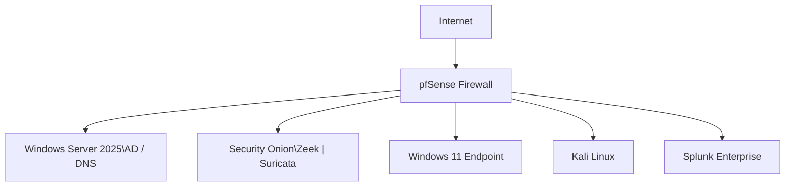

# JCE Cyber Lab 🛡️

## Executive Summary

The JCE Cyber Lab demonstrates my ability to **design, deploy, operate, and validate**
a complete **SOC detection engineering workflow** across **network, endpoint, and
identity layers**.

The lab consists of **hands-on attack simulations** with:
- Reproducible execution steps
- Real and symbolic log evidence
- Detection logic and alert definitions
- MITRE ATT&CK–aligned validation
- Documented issues, resolutions, and analyst takeaways

Each detection scenario has a **dedicated simulation folder (1:1 mapping)** to ensure
results are **repeatable, auditable, and defensible**.

---

## 🧭 Repository Navigation

### 🔍 Core References
- 📊 **[Detection Validation Matrix](detection-matrix/detection-validation-matrix.md)** – Authoritative simulation status  
- 🚧 **[Issues & Resolutions](issues-and-resolutions/)** – Root causes, fixes, and lessons learned  

### 🧪 Validated Simulations
- ✅ **[SIM-001 – Phishing Email](simulations/SIM-001-Phishing-Email/)** – Initial Access  
- ✅ **[SIM-002 – DNS Tunneling](simulations/SIM-002-DNS-Tunneling/)** – Command & Control  
- ✅ **[SIM-003 – SQL Injection](simulations/SIM-003-SQL-Injection/)** – Application Exploitation  
- 🧪 **[SIM-004 – Sysmon Process Create](simulations/SIM-004-Sysmon-Process-Create/)** – Execution Baseline  
- ✅ **[SIM-005 – Privilege Escalation](simulations/SIM-005-Privilege-Escalation/)** – Post-Exploitation  

---

## 🔧 Lab Topology (High-Level)

| System | Role |
|------|------|
| **pfSense** | Firewall, routing, NAT, DHCP, traffic mirroring |
| **Windows Server 2025** | Active Directory, DNS |
| **Security Onion** | Network Security Monitoring (Zeek, Suricata, PCAP) |
| **Windows 11** | User endpoint (Sysmon, Windows Security Logs) |
| **Kali Linux** | Attack simulation |
| **Ubuntu Server** | Splunk Enterprise SIEM |

> 🔎 **Detailed architecture, log flow, and design rationale:**  
> **[View Architecture Documentation](architecture/README.md)**  
> ℹ️ End-user endpoints (e.g., Windows 11) use **DHCP** to reflect real-world environments, while core infrastructure components use **static IPs**; endpoint detections rely on **hostname and telemetry context**, not IP addresses.

---

### Simplified Network Topology

## 📊 Detection Validation Matrix (Authoritative)

This lab follows a **1:1 mapping** between detection scenarios and simulations.  
Each simulation folder contains complete technical evidence.

➡️ **[View the Detection Validation Matrix](detection-matrix/detection-validation-matrix.md)**

| Area | Coverage |
|------|----------|
| Initial Access | Phishing |
| Execution | Sysmon process telemetry |
| Privilege Escalation | UAC / elevated execution |
| Command & Control | DNS tunneling |
| Network Attacks | SQL injection |
| Detection Engineering | Queries, alerts, correlation |
| Validation Evidence | Logs + screenshots |

> 📌 **Authoritative Source:**  
> The Detection Validation Matrix is the **single source of truth** for simulation status.

---

## 🧪 Simulations (Hands-On Evidence)

Each simulation includes:
- `README.md` – Objective and scope
- `steps.md` – Reproducible execution
- `logs.md` – Real and symbolic evidence
- `queries.md` – Detection logic
- `alert-config.md` – Alert definition
- `screenshots/` – Proof of validation

---

## 📊 Detection & Response Capabilities

- **SIEM:** Splunk Enterprise  
- **Network Security Monitoring:** Zeek + Suricata (Security Onion)  
- **Endpoint Telemetry:** Sysmon, Windows Security Logs  
- **Threat Hunting:** Hunt, SPL searches  
- **Incident Response Framework:** NIST 800-61  

---

## 🧑‍💻 Skills Demonstrated

- Detection engineering (Zeek, Sysmon, SPL)
- SOC investigation workflows
- Windows & Active Directory security logging
- Network traffic analysis
- IDS and packet-level inspection
- MITRE ATT&CK mapping
- Alert design and validation
- Root cause analysis and documentation

---

## 📌 How to Replicate This Lab

1. Deploy VMs based on the topology
2. Configure log ingestion into Splunk
3. Enable traffic mirroring to Security Onion
4. Execute simulations (SIM-001 → SIM-004)
5. Capture logs and screenshots
6. Validate detections
7. Update the Detection Validation Matrix

---

## 🚧 Issues & Resolutions Log

All technical issues encountered during simulations are documented with:
- Root cause
- Resolution
- Analyst takeaway
- Final status

👉 **[View Issues & Resolutions](issues-and-resolutions/)**

---

## 📈 Next Steps

- Add Velociraptor for DFIR endpoint collection
- Expand credential access and lateral movement simulations
- Build SOC-style dashboards
- Scale to multi-host / ESXi environment

---

> “Every detection is documented. Every alert is validated. Every scenario is reproducible.”  
> **— Carlo**

