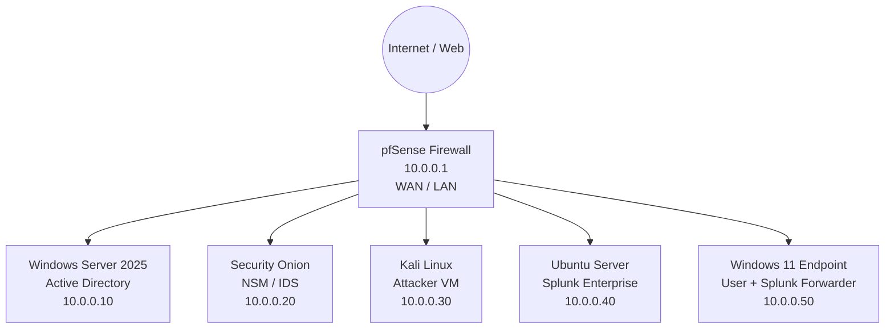
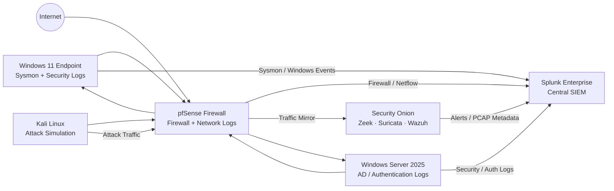

# JCE Cyber Lab 🛡️ 

## Executive Summary

This cyber lab demonstrates my ability to design, deploy, and operate a full detection engineering and SOC workflow across network, endpoint, and identity layers. It contains end-to-end attack simulations, symbolic and real log evidence, Splunk detections, alerting pipelines, and MITRE-aligned validation. Each detection scenario has a **dedicated simulation folder (1:1 mapping)** to show reproducible, hands-on results.

---

## 🔧 Lab Topology

* **pfSense** (10.0.0.1) – Firewall, NAT, VPN, TAP/SPAN mirroring  
* **Windows Server 2025** (10.0.0.10) – AD, DNS, GPO, MS SQL Server  
* **Security Onion (Eval)** (10.0.0.20) – Suricata, Zeek, Wazuh, Syslog  
* **Kali Linux** (10.0.0.30) – Red-team simulations and tooling  
* **Windows 11 Endpoint** (10.0.0.50) – Windows Security Auditing, Splunk Universal Forwarder  
* **Ubuntu VM** (10.0.0.60) – Splunk Enterprise SIEM  

### Network Diagram


### Network & Log Flow Architecture


### 🔍 What This Diagram Is Showing (Plain English)
*1️⃣ Endpoint & Identity Logs*
- Windows 11
   - Sysmon (process creation, privilege escalation, persistence)
   - Windows Security logs
- Windows Server 2025 (AD)
   - Logons (4624 / 4625)
   - Privilege changes
   - Kerberos activity
*Both forward ➡️ logs directly to Splunk*
> This mirrors real SOC environments — endpoints don’t send logs through the firewall.

*2️⃣ Network & Firewall Visibility*
- pfSense
   - Firewall allow/deny logs
   - Network session metadata
   - Internet ingress/egress
Logs go to:
   - Splunk (correlation + dashboards)
   - Security Onion (deep packet inspection)
This gives you:
   - Control plane (Splunk)
   - Data plane (Security Onion)

*3️⃣ Security Onion’s Role*
Security Onion observes traffic passively:
- Zeek → protocol & session analysis
- Suricata → IDS signatures
- PCAP → packet-level evidence
➡️ Alerts + metadata forwarded to Splunk
➡️ PCAP stays local for investigation

*4️⃣ Attack Simulation Flow*
- Kali Linux
   - Generates malicious traffic
   - Executes exploits
- Traffic passes through pfSense
- Hits Windows 11 or AD
- Detected by:
   - Sysmon (endpoint)
   - Zeek/Suricata (network)
   - Correlated in Splunk

> 💡 This is end-to-end detection engineering, not just log collection.

*All telemetry is centrally correlated in Splunk, with Security Onion providing deep packet and IDS visibility.*

---

## 📊 Detection Validation Matrix (Authoritative)

This lab follows a **1:1 mapping model** between detection scenarios and hands-on simulations.
Each simulation folder contains full technical evidence:

- Reproducible execution steps
- Symbolic and real log evidence
- SPL detection queries
- Alert configurations
- Screenshots proving detection and alerting

➡️ **[View the Detection Validation Matrix](detection-matrix/detection-validation-matrix.md)**

### Summary Coverage
| Area | Coverage |
|-----|---------|
| Initial Access | Phishing, DNS abuse |
| Execution | Sysmon process telemetry |
| Privilege Escalation | UAC & elevated execution |
| Command & Control | DNS tunneling |
| Detection Engineering | SPL, correlation, alerting |
| Validation Evidence | Logs + screenshots per SIM |

> 📌 **Important:**  
> The Detection Validation Matrix is the **authoritative source of truth** for scenario status.  
> Individual simulation folders contain the supporting artifacts and evidence.

---

## 🧪 Simulations (Hands-On Evidence)

Every simulation contains:

* `README.md` – Summary + expected outcome  
* `steps.md` – Full reproducible steps  
* `logs.md` – Symbolic and real logs  
* `queries.md` – SPL detection logic  
* `alert-config.md` – Alert definition + symbolic ID  
* `screenshots/` – Evidence of hits and alerts  

### Available Simulations

* ✅ [SIM-001 – Phishing Email (Validated)](simulations/SIM-001-Phishing-Email/)  
* ✅ [SIM-002 – DNS Tunneling (Validated)](simulations/SIM-002-DNS-Tunneling/)  
* ✅ [SIM-003 – Privilege Escalation](simulations/SIM-003-Privilege-Escalation/)  
* [SIM-004 – SQL Injection](simulations/SIM-004-SQL-Injection/)  
* [SIM-005 – Unauthorized File Access](simulations/SIM-005-Unauthorized-File-Access/)  
* [SIM-006 – Sysmon ProcessCreate](simulations/SIM-006-Sysmon-ProcessCreate/)  
* [SIM-007 – Sysmon FileCreate](simulations/SIM-007-Sysmon-FileCreate/)  
* [SIM-008 – PowerShell Download](simulations/SIM-008-PowerShell-Download/)  

---

## 📂 Repository Structure
```text
jce-cyber-lab/
├── README.md
├── diagrams/
├── detection-matrix/
├── simulations/
│   ├── SIM-001-Phishing-Email/
│   ├── SIM-002-DNS-Tunneling/
│   ├── SIM-003-Privilege-Escalation/
│   ├── SIM-004-SQL-Injection/
│   ├── SIM-005-Unauthorized-File-Access/
│   ├── SIM-006-Sysmon-ProcessCreate/
│   ├── SIM-007-Sysmon-FileCreate/
│   └── SIM-008-PowerShell-Download/
├── splunk-queries/
├── alerts/
├── dashboards/
├── issues-and-resolutions/
├── troubleshooting/
└── scratchpad/
```

---

## 📊 Detection & Response Capabilities

* **SIEM:** Splunk Enterprise (Ubuntu)  
* **NSM/IDS:** Suricata + Zeek (Security Onion)  
* **HIDS / Telemetry:** Windows Security Auditing, Sysmon, Wazuh  
* **Threat Hunting:** SPL dashboards, network analysis  
* **IR Framework:** NIST 800-61  

---

## ⚙️ Automation

* n8n workflows for automated triage  
* Python scripts for log parsing and anomaly detection  
* Custom symbolic log tagging  

---

## 🧑‍💻 Skills Demonstrated

* SIEM engineering (Splunk)
* Detection engineering and SPL writing
* Windows Security Auditing & command-line logging
* Sysmon rule validation
* Suricata/Zeek NSM analysis
* Log ingestion + parsing pipeline design
* MITRE ATT&CK mapping
* Incident response workflow creation
* Dashboard creation and alert tuning

---

## 📌 How to Replicate This Lab

1. Deploy all VMs based on the topology diagram.  
2. Install Splunk on Ubuntu and configure ingest from:
   * Windows Security Logs (via Splunk UF)
   * Sysmon (for Sysmon-based sims)
   * Security Onion (Suricata/Zeek logs)  
3. Configure pfSense routes + monitoring.  
4. Run simulations in order (SIM-001 → SIM-008).  
5. Capture logs and screenshots as evidence.  
6. Validate detections using dashboards and alerts.  
7. Update detection-matrix with results.  

---

## 🚧 Lab Issues & Resolutions Log

Throughout the JCE Cyber Lab simulations, various technical challenges were encountered and resolved.
Click below to view simulation-specific troubleshooting details:

👉 **[Issues & Resolutions Index](./issues-and-resolutions/README.md)**

---

## 📈 Next Steps

* Add Velociraptor for DFIR endpoint collection  
* Add more credential access simulations  
* Expand to VMware ESXi cluster  
* Build a full SOC dashboard pack  

***“Every detection is documented. Every alert is validated. Every scenario is reproducible.”***
**— Carlo**
