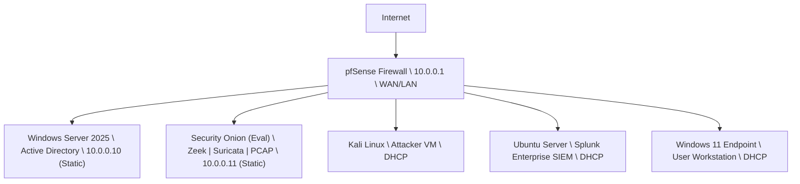
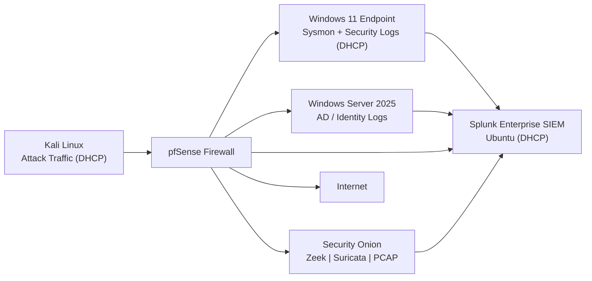

# JCE Cyber Lab 🛡️

## Executive Summary

The JCE Cyber Lab demonstrates my ability to **design, deploy, operate, and validate**
a full **SOC detection engineering workflow** across **network, endpoint, and identity
layers**.

The lab contains **end-to-end attack simulations** with:
- Reproducible execution steps
- Real and symbolic log evidence
- Detection logic and alert definitions
- MITRE ATT&CK–aligned validation
- Documented issues, resolutions, and analyst takeaways

Each detection scenario has a **dedicated simulation folder (1:1 mapping)** to ensure
results are **repeatable, auditable, and defensible**.

---

## 🧭 Repository Navigation

Use the links below to quickly navigate the JCE Cyber Lab and supporting artifacts:

### 🔍 Core References
- 📊 **[Detection Validation Matrix](detection-matrix/detection-validation-matrix.md)** – Authoritative status of all simulations  
- 🚧 **[Issues & Resolutions](issues-and-resolutions/)** – Root causes, fixes, and analyst takeaways  

### 🧪 Simulations (Validated)
- ✅ **[SIM-001 – Phishing Email](simulations/SIM-001-Phishing-Email/)**
- ✅ **[SIM-002 – DNS Tunneling](simulations/SIM-002-DNS-Tunneling/)**
- ✅ **[SIM-003 – Privilege Escalation](simulations/SIM-003-Privilege-Escalation/)**
- ✅ **[SIM-004 – SQL Injection](simulations/SIM-004-SQL-Injection/)**

### 🛠 Supporting Material
- 🗂 **[Diagrams](diagrams/)** – Network topology and log flow visuals  
- 📁 **[Splunk Queries](splunk-queries/)** – SPL detection logic  
- 🚨 **[Alerts](alerts/)** – Alert definitions and symbolic IDs  
- 📊 **[Dashboards](dashboards/)** – SOC-style dashboards  
- 🧪 **[Troubleshooting](troubleshooting/)** – Lab fixes and experiments  

---

## 🔧 Lab Topology

* **pfSense** (10.0.0.1) – Firewall, NAT, routing, traffic mirroring, **DHCP server**  
* **Windows Server 2025** (10.0.0.10) – Active Directory, DNS, GPO (static IP)  
* **Security Onion** (10.0.0.11) – Zeek, Suricata, PCAP, Hunt (static IP)  
* **Windows 11 Endpoint** – DHCP-assigned IP (Sysmon, Windows Security Auditing)  
* **Kali Linux** – DHCP-assigned IP (attack simulation and adversary tooling)  
* **Ubuntu Server** – DHCP-assigned IP (Splunk Enterprise SIEM)  

---

### Network Diagram


---

### Network & Log Flow Architecture


---

**🔁 DHCP vs Static IP Design Rationale**  

This lab intentionally uses a hybrid IP addressing strategy to mirror
real-world enterprise and SOC environments.

> 💡 Endpoints and attacker systems intentionally use **DHCP** to mirror real
> enterprise networks and ensure detections rely on **telemetry and behavior**
> rather than static IP assumptions.

---

**🔒 Static IP Assignments (Infrastructure Components)**  

The following systems use static IP addresses:
- pfSense Firewall (10.0.0.1)
- Windows Server 2025 (Active Directory) (10.0.0.10)
- Security Onion (Eval) (10.0.0.11)
**Rationale:**  
- These systems provide core infrastructure services  
- Static addressing ensures:
   - Reliable log forwarding targets
   - Consistent detection and correlation
   - Predictable sensor placement and visibility
- Reflects standard enterprise design for:
   - Firewalls
   - Identity services
   - Network security monitoring

---

**🔄 DHCP Addressing (Endpoints & Tooling)**  

The following systems use DHCP:
- Windows 11 Endpoint
- Kali Linux (Attack VM)
- Ubuntu Server (Splunk Enterprise SIEM)
**Rationale:**  
- Endpoints commonly receive IPs dynamically in real environments
- DHCP enables:
   - Realistic host churn
   - Accurate testing of detection logic that relies on behavior, not fixed IPs
   - SOC workflows that track hosts by:
      - Hostname
      - User
      - Process
      - Log context (not hard-coded IPs)
- Demonstrates analyst adaptability to dynamic environments

---

**🧠 Detection Engineering Impact**  

This design reinforces best practices in SOC detection engineering:
- Detections avoid brittle IP-based logic
- Correlation relies on:
   - Host identity
   - Process behavior
   - Network patterns
- Simulations remain reproducible even as IPs change

> 💡 This reflects how detections are built in production SOCs—
> infrastructure is stable, endpoints are dynamic, and detections must adapt.

---

## 🔍 What This Architecture Demonstrates
**1️⃣ Endpoint & Identity Visibility**
- Sysmon and Windows Security logs from Windows 11
- Authentication and privilege activity from Active Directory
- Logs forwarded directly to Splunk (SOC-realistic)

**2️⃣ Network & IDS Visibility**
- pfSense provides firewall and session context
- Security Onion passively inspects mirrored traffic:
    - Zeek → protocol metadata
    - Suricata → IDS signatures
    - PCAP → packet-level evidence

**3️⃣ Detection Engineering Flow**
- Attacks generated from Kali
- Traffic traverses pfSense
- Telemetry captured by:
   - Sysmon (endpoint)
   - Zeek / Suricata (network)
- Detections validated in Hunt and correlated in Splunk

> 💡 This lab emphasizes detection engineering, not just log collection.

---

## 📊 Detection Validation Matrix (Authoritative)

The lab follows a 1:1 mapping between simulations and detections.
Each simulation folder contains complete technical evidence.

➡️ **[View the Detection Validation Matrix](detection-matrix/detection-validation-matrix.md)**

**Summary Coverage**
| Area	| Coverage |
|-------|-----------|
| Initial Access	| Phishing |
| Execution	| Sysmon process telemetry |
| Privilege Escalation	| UAC / elevated execution |
| Command & Control	| DNS tunneling |
| Network Attacks	| SQL injection |
| Detection Engineering	| Queries, alerts, correlation |
| Validation Evidence	| Logs + screenshots |

> 📌 The Detection Validation Matrix is the single source of truth for simulation status.

---

## 🧪 Simulations (Hands-On Evidence)

Each simulation includes:
- `README.md` – Objective and scope
- `steps.md` – Reproducible execution
- `logs.md` – Real and symbolic evidence
- `queries.md` – Detection logic
- `alert-config.md` – Alert design
- `screenshots/` – Proof of validation

Validated Simulations
- ✅ SIM-001 – Phishing Email
- ✅ SIM-002 – DNS Tunneling
- ✅ SIM-003 – Privilege Escalation
- ✅ SIM-004 – SQL Injection

Planned / In Progress
- SIM-005 – Unauthorized File Access
- SIM-006 – Sysmon ProcessCreate
- SIM-007 – Sysmon FileCreate
- SIM-008 – PowerShell Download

---

## 📂 Repository Structure
```text
jce-cyber-lab/
├── README.md
├── diagrams/
├── detection-matrix/
├── simulations/
├── splunk-queries/
├── alerts/
├── dashboards/
├── issues-and-resolutions/
├── troubleshooting/
└── scratchpad/
```

---

## 📊 Detection & Response Capabilities
- SIEM: Splunk Enterprise
- NSM / IDS: Zeek + Suricata (Security Onion)
- Endpoint Telemetry: Sysmon, Windows Security Logs
- Threat Hunting: Hunt, SPL, dashboards
- IR Framework: NIST 800-61

---

## 🧑‍💻 Skills Demonstrated
- Detection engineering (Zeek, Sysmon, SPL, KQL)
- SOC investigation workflows
- Windows and AD security logging
- Network traffic analysis
- IDS and packet-level inspection
- MITRE ATT&CK mapping
- Alert design and validation
- Root cause analysis and documentation

---

## 📌 How to Replicate This Lab
1. Deploy VMs according to the topology diagram
2. Configure log ingestion into Splunk
3. Enable traffic mirroring to Security Onion
4. Execute simulations (SIM-001 → SIM-004)
5. Capture logs and screenshots
6. Validate detections
7. Update the Detection Validation Matrix

---

## 🚧 Issues & Resolutions Log

All technical issues encountered during simulations are documented with:
- Root cause
- Resolution
- Analyst takeaway
- Final status

Throughout the JCE Cyber Lab simulations, various technical challenges were encountered and resolved.  
Click below to view simulation-specific troubleshooting details:

👉 **[View Issues & Resolutions](issues-and-resolutions/)**

---

## 📈 Next Steps
- Add Velociraptor for DFIR endpoint collection
- Expand credential access and lateral movement simulations
- Build SOC-style dashboards and metrics
- Scale to ESXi / multi-host environment

---

> “Every detection is documented. Every alert is validated. Every scenario is reproducible.”
> — Carlo
