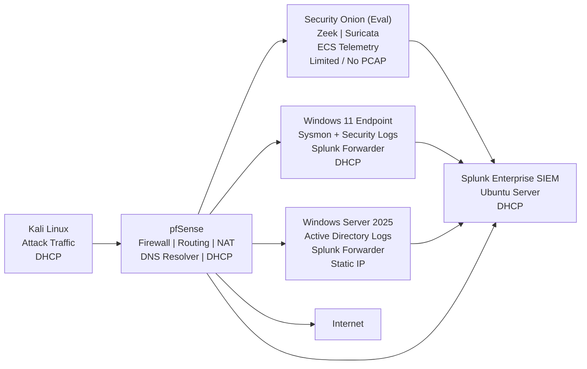

# Network & Log Flow

This document describes how **network traffic and security telemetry**
flow through the JCE Cyber Lab, from generation to detection, correlation,
and investigation.

The design mirrors **real-world SOC architectures**, emphasizing:
- Passive network monitoring
- Centralized DNS and log visibility
- Behavioral detection over static assumptions
- Clear separation of control, data, and detection planes

---

## 🔄 High-Level Log Flow Overview

All systems communicate through a central firewall (**pfSense**), which
acts as both a **control point** and a **primary observation point** for network activity,
including DNS resolution.

Security visibility is achieved through a combination of:
- Endpoint telemetry (Sysmon, Windows Security)
- Network protocol analysis (Zeek)
- Intrusion detection (Suricata)
- Centralized SIEM correlation (Splunk)

---

## 📊 Network & Log Flow Diagram

---

## 🧭 Traffic Flow (Plain English)

### 1️⃣ Attack & User Traffic Generation

- **Kali Linux** generates simulated attack traffic, including:
  - Phishing
  - DNS tunneling
  - Privilege escalation attempts
  - Network and Web-based attacks
- **Windows 11** generates normal user and endpoint activity
- All traffic (including DNS queries) flows through **pfSense**

---

### 2️⃣ Firewall & Routing Layer (pfSense)

**pfSense** serves as the central network choke point and DNS resolver:

- Routes all ingress and egress traffic
- Provides NAT and DHCP services
- Acts as the primary DNS resolver for all hosts
- Logs firewall decisions and session metadata, and DNS activity
- Mirrors network traffic to **Security Onion**

This ensures:
- No system bypasses inspection
- DNS activity is centrally observable
- Network behavior is consistently monitored

---

### 3️⃣ Network Security Monitoring (Security Onion - EVAL)

**Security Onion** passively receives mirrored traffic from pfSense and provides:

- **Zeek**
  - Protocol-level metadata (DNS, HTTP, connections)
  - Session context and behavioral indicators

- **Suricata**
  - Signature-based IDS detection
  - Network threat indicators

- Evaluation Mode Constraints
  - Limited or no PCAP retention
  - Detections rely primarily on parsed telemetry (ECS-normalized events)

**Security Onion:**  
- Is not inline
- Does not block traffic
- Exists purely for visibility and detection

> All Security Onion telemetry is forwarded to Splunk for correlation.

---

### 4️⃣ Endpoint & Identity Telemetry

#### Windows 11 Endpoint

Generates:
- Sysmon events (process creation, command-line activity)
- Windows Security logs

Behavior:
- Logs are forwarded **directly to Splunk** via **Splunk Universal Forwarder**
- Logs do not traverse pfSense as data payloads (only network transport)

---

#### Windows Server 2025 (Active Directory)

Generates:
- Authentication events
- Privilege and group membership changes
- Identity-related telemetry

Behavior:
- Logs are forwarded directly to **Splunk**
- DNS services are not hosted on AD in this lab

This reflects real enterprise design where:

> Endpoints send logs to the SIEM independently of network routing.
> Identity services and DNS resolution are intentionally decoupled.

---

### 5️⃣ Centralized Correlation & Detection (Splunk Enterprise)

**Splunk Enterprise** acts as the **single pane of glass** for:

- Endpoint telemetry
- Identity activity
- Firewall and DNS logs
- Security Onion netwrok metadata

Splunk is used to:
- Correlate events across layers
- Validate detections
- Trigger alerts
- Support investigation workflows

**Security Onion** provides deep network context;  
**Splunk** provides cross-layer correlation and alerting.

---

## 🔁 Detection Engineering Perspective

This log flow design enforces several detection best practices:

- Network detections do not rely on endpoint trust
- Endpoint detections do not rely on network signatures
- DNS detections are network-based, not AD-dependent
- IP addresses are not treated as stable identifiers

Correlation is based on:
- Host identity
- Process behavior
- Network and DNS patterns
- Temporal relationships

This enables detections that remain effective even when:
- IPs change (DHCP)
- Attack infrastructure rotates
- Full packet capture is unavailable

---

## 🧠 SOC Realism & Resilience

The architecture intentionally supports **degraded visibility scenarios**:

- Network telemetry exists without PCAP
- Endpoint detections function independently of IDS alerts
- Identity detections persist even if network data is delayed

This mirrors real SOC operations, where:

> Analysts must investigate and respond with incomplete or imperfect telemetry.

---

## 🏁 Status

- Network traffic flow validated
- Log ingestion paths confirmed
- Security Onion successfully observing mirrored traffic
- Splunk correlating multi-source telemetry
- Actively used in **SIM-001 through SIM-004**
