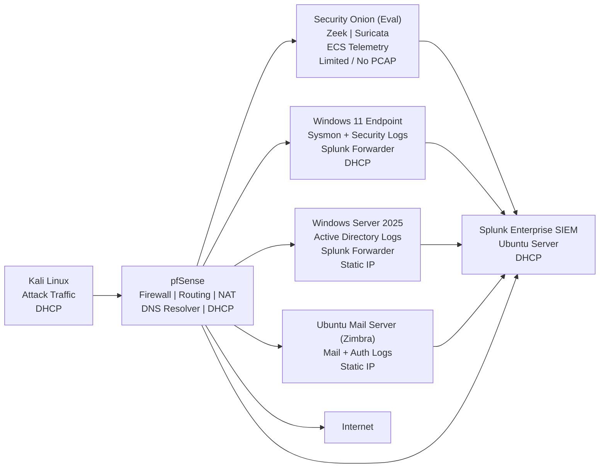

# Network & Log Flow

This document describes how **network traffic and security telemetry**
flow through the Enterprise Security Operations Environment (JCE), from generation to detection, correlation,
and investigation.

The design mirrors **real-world SOC architectures**, emphasizing:
- Passive network monitoring
- Centralized DNS and log visibility
- Behavioral detection over static assumptions
- Clear separation of control, data, and detection planes
- Email + identity telemetry as first-class detection sources

---

## 🔄 High-Level Log Flow Overview

All systems communicate through a central firewall (**pfSense**), which
acts as both a **control point** and a **primary observation point** for network activity,
including DNS resolution.

Security visibility is achieved through a combination of:

- Endpoint telemetry (Sysmon, Windows Security)
- Network protocol analysis (Zeek)
- Intrusion detection (Suricata)
- Identity telemetry (Active Directory)
- **Email & authentication telemetry (Zimbra)**
- Centralized SIEM correlation (Splunk)

---

## 📊 Network & Log Flow Diagram

---

## 🧭 Traffic Flow (Plain English)

### 1️⃣ Attack, User, and Email Activity

- **Kali Linux** generates simulated attack traffic, including:
  - Phishing infrastructure
  - DNS tunneling
  - Web attacks

- **Windows 11** generates normal user and endpoint activity

- **Zimbra Mail Server** generates:
  - Email login attempts
  - Message sending/receiving events
  - Admin actions
  - Account authentication telemetry

All traffic (including DNS queries) flows through **pfSense**.

---

### 2️⃣ Firewall & Routing Layer (pfSense)

**pfSense** serves as the central network choke point and DNS resolver:

- Routes all ingress and egress traffic
- Provides NAT and DHCP services
- Acts as the primary DNS resolver for all hosts
- Logs firewall decisions and DNS activity
- Mirrors network traffic to **Security Onion**

This ensures:

- No system bypasses inspection
- DNS activity is centrally observable
- Network behavior is consistently monitored

---

### 3️⃣ Network Security Monitoring (Security Onion - EVAL)

**Security Onion** passively receives mirrored traffic from pfSense and provides:

#### Zeek
- Protocol-level metadata (DNS, HTTP, connections)
- Session context and behavioral indicators

#### Suricata
- Signature-based IDS detection
- Network threat indicators

#### Evaluation Mode Constraints
- Limited or no PCAP retention
- Detections rely primarily on parsed telemetry

Security Onion:
- Is not inline
- Does not block traffic
- Exists purely for visibility and detection

All Security Onion telemetry is forwarded to **Splunk**.

---

### 4️⃣ Endpoint, Identity, and Email Telemetry

#### Windows 11 Endpoint

Generates:
- Sysmon events
- Windows Security logs

Behavior:
- Logs forwarded directly to **Splunk**
- Network routing does not determine log visibility

---

#### Active Directory (Windows Server 2025)

Generates:
- Authentication events
- Privilege changes
- Account lockouts

Behavior:
- Logs forwarded directly to **Splunk**
- Provides identity context for detections

---

#### Zimbra Mail Server (Ubuntu – 10.0.0.14)

Generates high-value SOC telemetry:
- Webmail login successes/failures
- IMAP/SMTP authentication attempts
- Account lockouts / brute-force indicators
- Message flow metadata
- Admin activity

Behavior:
- Mail server logs are forwarded to **Splunk**
- Authentication events correlate with AD and endpoint activity

This enables realistic detection scenarios such as:
- Phishing → credential use
- Password spraying against mail
- Compromised mailbox → lateral movement

---

### 5️⃣ Centralized Correlation & Detection (Splunk Enterprise)

**Splunk Enterprise** acts as the **single pane of glass** for:

- Endpoint telemetry
- Identity activity
- Firewall and DNS logs
- Security Onion metadata
- Zimbra email and authentication logs

Splunk enables:
- Cross-layer correlation
- Alerting and dashboards
- Detection validation
- Investigation workflows

---

## 🔁 Detection Engineering Perspective

This design enforces SOC-grade detection practices:

- Email telemetry feeds identity detections
- Identity telemetry feeds endpoint investigations
- Network telemetry validates infrastructure activity
- Detections do not rely on static IPs

Correlation focuses on:
- Host identity
- User behavior
- Authentication patterns
- Network and DNS behavior
- Email activity chains

---

## 🧠 SOC Realism & Resilience

The architecture supports degraded visibility scenarios:

- Network telemetry exists without PCAP
- Endpoint detections work without IDS
- Identity detections work without network alerts
- Email telemetry provides initial access visibility

This mirrors real SOC operations where:

> Analysts investigate across layers with imperfect data.

---

## 🏁 Status

- Network traffic flow validated  
- Log ingestion paths confirmed  
- Security Onion observing mirrored traffic  
- Splunk correlating multi-source telemetry  
- Mail server integrated into detection workflows  
- Actively used in **SIM-001 through SIM-004**
