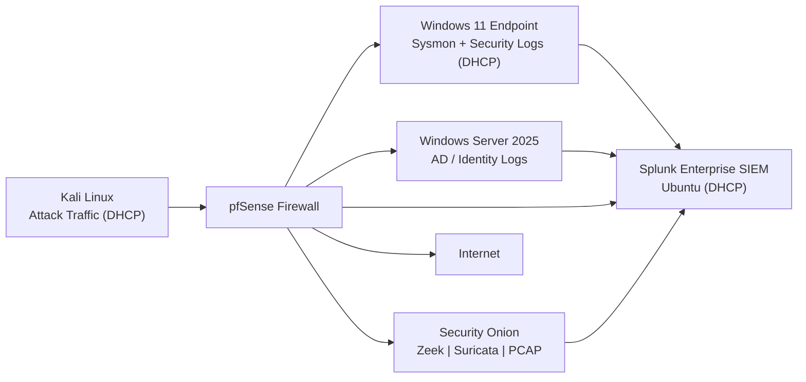

# Network & Log Flow

This document describes how **network traffic and security telemetry**
flow through the JCE Cyber Lab, from generation to detection, correlation,
and investigation.

The design mirrors **real-world SOC architectures**, emphasizing:
- Passive network monitoring
- Centralized log correlation
- Behavioral detection over static assumptions
- Clear separation of control, data, and detection planes

---

## 🔄 High-Level Log Flow Overview

All systems communicate through a central firewall (**pfSense**), which
acts as both a **control point** and an **observation point**.

Security visibility is achieved through a combination of:
- Endpoint telemetry
- Network protocol analysis
- Intrusion detection
- Centralized SIEM correlation

---

## 📊 Network & Log Flow Diagram

## 🧭 Traffic Flow (Plain English)

### 1️⃣ Attack & User Traffic Generation

- **Kali Linux** generates simulated attack traffic, including:
  - Phishing
  - DNS tunneling
  - Privilege escalation attempts
  - Web-based attacks
- **Windows 11** generates normal user and endpoint activity
- All traffic flows through **pfSense**

---

### 2️⃣ Firewall & Routing Layer (pfSense)

**pfSense** serves as the central network choke point:

- Routes all ingress and egress traffic
- Provides NAT and DHCP services
- Logs firewall decisions and session metadata
- Mirrors traffic to **Security Onion**

This ensures:
- No system bypasses inspection
- Network behavior is consistently observable

---

### 3️⃣ Network Security Monitoring (Security Onion)

**Security Onion** passively receives mirrored traffic from pfSense and provides:

- **Zeek**
  - Protocol-level metadata (DNS, HTTP, connections)
  - Session context and behavioral indicators

- **Suricata**
  - Signature-based IDS detection
  - Network threat indicators

- **PCAP**
  - Full packet capture for forensic validation

Security Onion does **not** sit inline and does **not** block traffic.  
It exists purely for **visibility and detection**.

---

### 4️⃣ Endpoint & Identity Telemetry

#### Windows 11 Endpoint

Generates:
- Sysmon events (process creation, privilege escalation)
- Windows Security logs

Behavior:
- Logs are forwarded **directly to Splunk**
- Logs do **not** route through pfSense

---

#### Windows Server 2025 (Active Directory)

Generates:
- Authentication events
- Privilege changes
- Identity-related telemetry

Behavior:
- Logs are forwarded directly to **Splunk**

This reflects real enterprise design where:

> Endpoints send logs to the SIEM independently of network routing.

---

### 5️⃣ Centralized Correlation (Splunk Enterprise)

**Splunk** acts as the **single pane of glass** for:

- Endpoint telemetry
- Identity activity
- Firewall logs
- Security Onion metadata

Splunk is used to:
- Correlate events across layers
- Validate detections
- Trigger alerts
- Support investigation workflows

**Security Onion** provides deep network context;  
**Splunk** provides cross-layer correlation.

---

## 🔁 Detection Engineering Perspective

This log flow design enforces several detection best practices:

- Network detections do not rely on endpoint trust
- Endpoint detections do not rely on network signatures
- IP addresses are not treated as stable identifiers

Correlation is based on:
- Host identity
- Process behavior
- Protocol patterns
- Temporal relationships

This enables detections that remain effective even when:
- IPs change (DHCP)
- Attackers rotate infrastructure
- Partial telemetry is unavailable

---

## 🧠 SOC Realism & Resilience

The architecture intentionally supports **degraded visibility scenarios**:

- Packet capture can validate activity even if SIEM parsing fails
- Network telemetry exists independently of endpoint logging
- Endpoint detections remain valid without IDS alerts

This mirrors real SOC operations, where:

> Analysts must adapt to incomplete or delayed data pipelines.

---

## 🏁 Status

- Network traffic flow validated
- Log ingestion paths confirmed
- Security Onion successfully observing traffic
- Splunk correlating multi-source telemetry
- Actively used in **SIM-001 through SIM-004**
