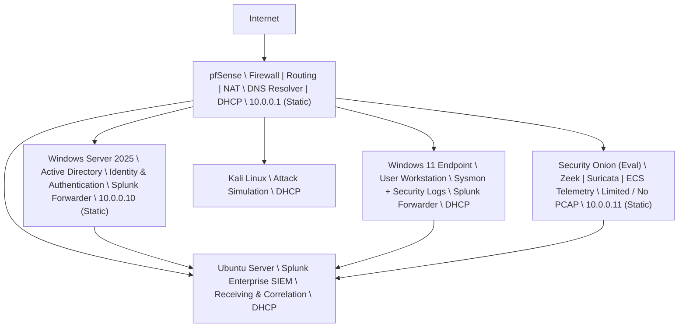

# Network Topology

This document describes the **network topology and system roles** used in the
JCE Cyber Lab. The topology is intentionally designed to reflect
**real-world enterprise and SOC environments**, with a clear separation
between infrastructure components, endpoints, and security monitoring.

---

## 🖧 High-Level Topology Overview

The lab is built around a **single routed internal network** protected and
managed by a central firewall. All traffic flows through **pfSense**, which
provides routing, NAT, DHCP, and traffic mirroring for security monitoring.

Core design goals:
- Centralized network control
- Passive network monitoring
- Realistic endpoint behavior
- Clear detection and log visibility

---

## 📐 Network Topology Diagram

---

## 🧱 System Roles & Responsibilities
**pfSense Firewall (10.0.0.1)**
- Acts as the network gateway for all systems
- Provides:
   - Routing and NAT
   - DNS resolver services for all hosts
   - DHCP services for endpoints
   - Firewall logging
   - Traffic mirroring to Security Onion
- Serves as the single choke point for ingress, egress, and DNS visibility
- Enables network-based detections (e.g., DNS tunneling) independent of AD

---

**Windows Server 2025 – Active Directory (10.0.0.10)**
- Provides identity and authentication services
- Hosts:
   - Active Directory
   - Group Policy
- Does not act as the primary DNS resolver
- Uses a static IP to ensure:
   - Reliable authentication
   - Predictable DNS resolution
   - Consistent log correlation
- Runs a Splunk Forwarder for AD and security logs
  
---

**Security Onion (EVAL) – Network Security Monitoring (10.0.0.11)**
- Passively monitors mirrored traffic from pfSense
- Provides:
   - Zeek for protocol and session analysis
   - Suricata for IDS signatures
   - ECS-normalized network telemetry
- Deployed in Evaluation mode
   - Limited or no PCAP retention
   - Detections prioritize parsed telemetry over raw packets
- Uses a static IP for management and analyst access
- Does not sit inline with traffic (non-intrusive)

---

**Windows 11 Endpoint (DHCP)**
- Represents a standard enterprise user workstation
- Generates:
   - Sysmon telemetry
   - Windows Security Event logs
- Runs a Splunk Universal Forwarder
- IP address assigned dynamically via DHCP
- Detection logic relies on:
   - Hostname
   - User context
   - Process behavior
   - Log metadata (not fixed IPs)

---

**Kali Linux – Attack Simulation Host (DHCP)**
- Used to simulate:
   - Phishing activity
   - DNS tunneling
   - Privilege escalation attempts
   - Network and Web attacks
- IP address assigned dynamically
- Reflects adversary infrastructure that is:
   - Ephemeral
   - Non-persistent
   - Not trusted by design
  
---

**Ubuntu Server – Splunk Enterprise SIEM (DHCP)**
- Hosts Splunk Enterprise
- Serves as the central correlation and analysis platform
- Ingests logs from:
   - Windows endpoints
   - Active Directory
   - pfSense
   - Security Onion metadata
- Uses DHCP to mirror:
   - Cloud-hosted SIEM deployments
   - Dynamic infrastructure common in modern SOCs

---

## 🔁 IP Addressing Strategy Summary

| System               | Addressing Type | Reason                                   |
|----------------------|-----------------|------------------------------------------|
| pfSense              | Static          | Core routing and firewall control        |
| Windows Server 2025  | Static          | Identity, DNS, authentication stability  |
| Security Onion       | Static          | Predictable sensor management            |
| Windows 11           | DHCP            | Realistic endpoint behavior              |
| Kali Linux           | DHCP            | Ephemeral attacker modeling              |
| Ubuntu (Splunk)      | DHCP            | SIEM flexibility and realism             |

---

## 🔁 DHCP vs Static IP Design Rationale

This lab intentionally uses a **hybrid IP addressing strategy** to mirror
real-world enterprise and SOC environments.

---

### 🔒 Static IP Assignments (Infrastructure Components)

- **pfSense Firewall**
- **Windows Server 2025 (Active Directory)**
- **Security Onion**

**Rationale:**
- These systems provide **core infrastructure services**
- Static addressing ensures:
  - Reliable log forwarding targets
  - Consistent detection and correlation
  - Predictable sensor placement and management
- Reflects standard enterprise design for:
  - Firewalls
  - Identity services
  - Network security monitoring

---

### 🔄 DHCP Addressing (Endpoints & Tooling)

- **Windows 11 Endpoint**
- **Kali Linux (Attack VM)**
- **Ubuntu Server (Splunk Enterprise SIEM)**

**Rationale:**
- Endpoints commonly receive IPs dynamically in production environments
- DHCP enables:
  - Realistic host churn
  - Accurate testing of detection logic that relies on **behavior**, not fixed IPs
  - SOC workflows that track hosts by:
    - Hostname
    - User
    - Process
    - Log/Telemetry context (not hard-coded IPs)
- Demonstrates analyst adaptability to dynamic environments

---

## 🧠 Detection Engineering Impact

This addressing and topology design reinforces **best practices in SOC-grade detection engineering**:
- Detections avoid brittle IP-based logic
- Correlation focuses on:
  - Host identity
  - Process behavior
  - Network patterns
- Simulations remain reproducible even as IPs change

> 💡 Infrastructure is stable, endpoints are dynamic, and detections must adapt —  
> this mirrors how detections are built and maintained in production SOCs.

---

## 🏁 Status

- Network topology validated
- All systems reachable and monitored
- Traffic successfully mirrored to Security Onion
- Topology actively used in **SIM-001 through SIM-004**
