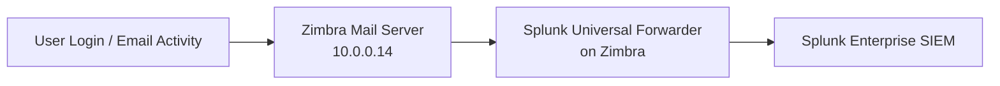

# Zimbra Mail Server → Splunk Log Ingestion

This document describes how telemetry from the **Ubuntu Mail Server (Zimbra)** is collected, transported, and used for detection inside the JCE Cyber Lab SIEM environment.

The goal is to treat **email and authentication activity** as first-class SOC telemetry alongside endpoint, identity, and network data.

---

## 📬 Why Mail Logs Matter

Email is the **#1 initial access vector** in real-world environments.

Zimbra provides visibility into:

- Phishing login attempts  
- Credential abuse  
- Password spraying  
- Account lockouts  
- Suspicious admin activity  
- Message flow anomalies  

This telemetry connects directly to:

> Email → Identity → Endpoint → Network → SIEM Correlation

---

## 🔄 Log Flow Overview



---

## 🗂 Log Sources on the Zimbra Server

| Log Type                     | Path                          | Detection Value                                   |
|-----------------------------|-------------------------------|--------------------------------------------------|
| Mailbox / Webmail Access    | `/opt/zimbra/log/mailbox.log` | Login attempts, user sessions, admin actions     |
| Mail Transfer Agent (Postfix) | `/var/log/mail.log`          | SMTP authentication, message flow                |
| Authentication / System     | `/var/log/auth.log`           | SSH logins, privilege abuse                      |
| System Events               | `/var/log/syslog`             | Service behavior and anomalies                   |

---

## ⚙️ Collection Method

The Zimbra server runs a **Splunk Universal Forwarder** to send logs directly to the SIEM.

### Inputs Configuration (`inputs.conf`)

```ini
[monitor:///opt/zimbra/log/mailbox.log]
index = zimbra
sourcetype = zimbra:mailbox

[monitor:///var/log/mail.log]
index = zimbra
sourcetype = zimbra:postfix

[monitor:///var/log/auth.log]
index = linux_secure
sourcetype = linux:auth

[monitor:///var/log/syslog]
index = linux
sourcetype = linux:syslog
```

---

## 📥 Data Path Characteristics

| Layer                | Role                                        |
|----------------------|---------------------------------------------|
| Zimbra Server        | Generates email + authentication telemetry  |
| Universal Forwarder  | Ships logs securely to Splunk               |
| Splunk               | Indexes, correlates, and alerts              |

Log transport is:

- Direct (host → SIEM)  
- Independent of pfSense routing logic  
- Not reliant on Security Onion  

This mirrors enterprise SIEM architecture.

---

## 🧠 Detection Use Cases Enabled

Zimbra telemetry supports SOC detections such as:

- Multiple failed logins to mail accounts  
- Password spraying against webmail  
- Successful login after repeated failures  
- Mail account compromise followed by endpoint activity  
- Suspicious admin console access  
- Abnormal outbound email volume (possible spam relay abuse)

---

## 🔗 Cross-Layer Correlation Examples

| Scenario                     | Correlation Chain                                      |
|------------------------------|--------------------------------------------------------|
| Phishing credential reuse    | Zimbra login → AD login → Sysmon process activity      |
| Password spraying            | Zimbra failures across many users → Suricata alerts    |
| Compromised mailbox          | Mail login → PowerShell execution on endpoint          |
| Lateral movement             | Mail login → RDP login → Endpoint telemetry            |

---

## 🏁 Outcome

With Zimbra integrated:

- Email becomes a monitored attack surface  
- Identity abuse becomes visible earlier  
- Detection chains span email → identity → endpoint → network  
- The lab now models enterprise SOC telemetry flow  

This architecture mirrors real production environments where:

> Email logs are critical to detecting and investigating initial access and account compromise.

