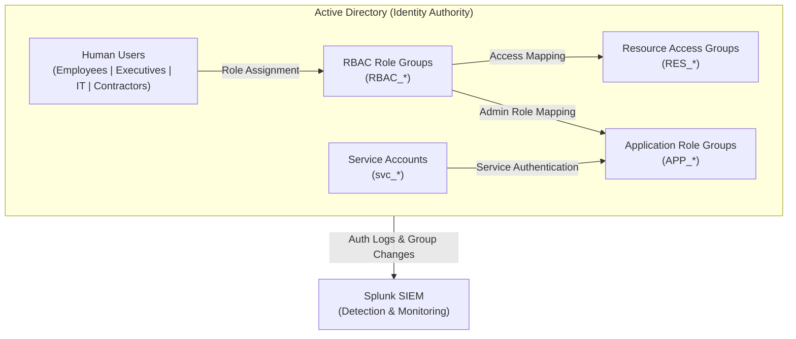

# 🗺 IAM Topology (Simplified)

This diagram illustrates how identities, role groups, application roles, and resource access groups interact within the Enterprise Security Operations Environment (JCE) Active Directory environment.

---

## 🔎 Relationship Model

| Layer | Role |
|------|------|
| Users | Represent human identities with Title and Department context |
| RBAC Groups | Define **who the user is** (job function / department) |
| APP Groups | Define administrative roles inside applications |
| RES Groups | Define access to file shares and resources |
| Service Accounts | Represent system-to-system authentication |
| SIEM | Monitors authentication, group changes, and identity activity |

---

## 🧠 Design Insight

This structure enforces separation between:

- **Identity (Users)**
- **Role (RBAC)**
- **Access (RES / APP)**
- **Service Identity (svc_*)**
- **Monitoring (SIEM)**

This separation improves governance, simplifies auditing, and enhances identity-aware detections.

> RBAC groups define *who the user is*; RES groups define *what the user can access*; APP groups define *administrative roles*; service accounts represent *non-human authentication identities*.
