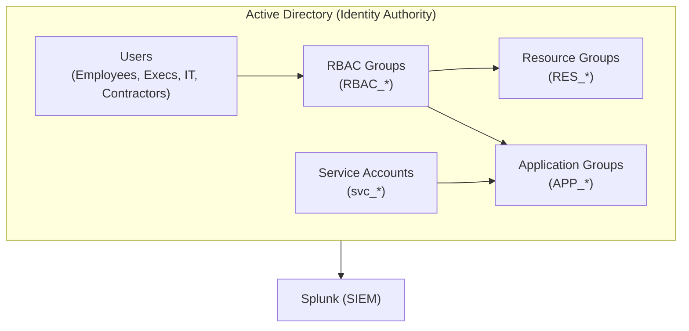

# 🗺 IAM Topology (Simplified)

```mermaid
flowchart TB
  subgraph AD["Active Directory (Identity Authority)"]
    Users["Users\n(Employees, Execs, IT, Contractors)"]
    Svc["Service Accounts\n(svc_*)"]
    RBAC["RBAC Groups\n(RBAC_*)"]
    APP["Application Groups\n(APP_*)"]
    RES["Resource Groups\n(RES_*)"]
  end

  Users --> RBAC
  RBAC --> RES
  RBAC --> APP
  Svc --> APP

  SIEM["Splunk (SIEM)"]
  AD --> SIEM
```

> RBAC groups define who the user is; RES groups define what they can access; APP groups define administrative roles in tools.
